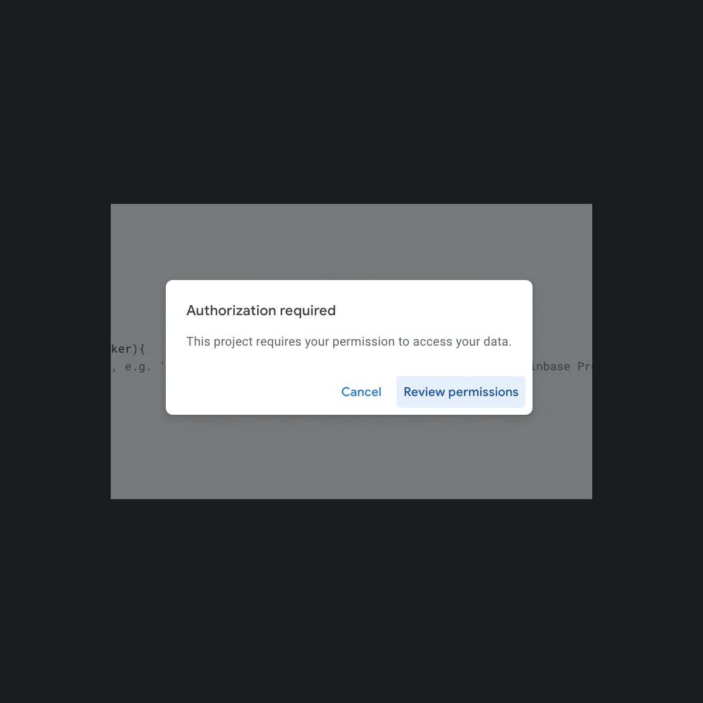
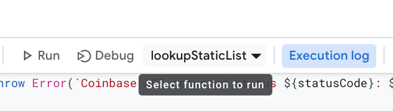
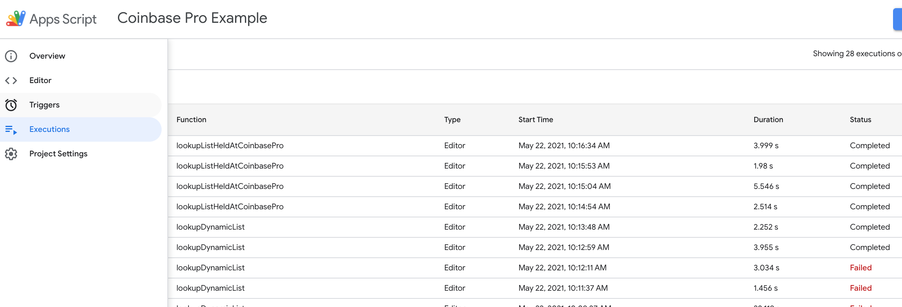

# Fetch Currency Rates from Coinbase Pro into a Google Sheet
This script lets you pull crypto rates from CoinbasePro into a basic Google Sheet. You can schedule it to run automatically. 

## Prerequisites
To use this, you will need
1. A Coinbase Pro API key and secret key and passphrase.
2. A Google sheet set up per the instructions below. 

## Instructions
1. Make sure you are logged in to the Google account you want to run this under.
1. [Make a copy of this Sample Sheet](https://docs.google.com/spreadsheets/d/1LnyhRtlDq5tIDITqsImWMgVeNMy74KzOUk6fpqObea0/copy?usp=sharing)
   in your Google Drive. ([or View it first](https://docs.google.com/spreadsheets/d/1LnyhRtlDq5tIDITqsImWMgVeNMy74KzOUk6fpqObea0/edit?usp=sharing)).
It has 2 named tabs and a simple column format expected by the script.

1. Open the "conf" tab in the Sheet. 
1. Fill in your Coinbase Pro API key, secret key, and passphrase into this sheet. 
No one else has access to this file unless you share it with them.

1. In Google Sheets, open the Menu `Tools > Script Editor`.
1. Copy and paste the text contents of the [Code.js](Code.js) file into the Google Script Editor, entirely replacing the sample myFunction. Save. 

1. Give your overall Script project a name (instead of Untitled). Save. 
   
1. Your default script in Google is called `Code.gs`. The code has 2 primary functions of interest.

    * `lookupStaticList`  -> fetches prices for a hardcoded list of currencies into the sheet

    * `lookupListHeldAtCoinbasePro` -> fetches prices for whatever currencies are in your Coinbase Pro account   
   
 
#### Oauth setup
1. The first time you run a script on your sheet, you will need to grant permissions from _your_ script to _your_ Google Drive account for this script to work.

!! You will get a warning that this isn't a verified app. That is correct. This is your personal script running on your personal Google account. I have no access or awareness of your copy.

!! Security note - you can and should look through the entire [Code.js](Code.js) script to confirm the only external urls are the Coinbase API. No bad actors.
   
2. Click through the Google approval flow and grant access. At the time I did this, this was a 4 step process:

    

1. Once you've enabled permissions, you can run & debug functions with breakpoints. It's pretty cool!

## Run and Debug
* While working manually, choose the function you want from the dropdown list above the editor. Then Run or Debug.

   

* If you get 404s when it runs, your Coinbase API keys are probably not configured correctly in your sheet. 

* Edit the `Code.gs` script however you want and have fun! 

## Schedule this to run automatically

Once you're ready to schedule this to run on a regular cadence and it's passing successfully when you Run it, you can set up autoruns manually or through code.

To do so manually:
   * go to the Triggers left nav menu in the Google Script Editor
   * click `+ Add Trigger` button and follow instructions 

To use code: 
   * Find the `setupTimeDrivenTriggers` function in your script.
   * Edit the name of the function you want to run and the frequency. I like every 12 hours. 
   * Manually Run the function from the editor once.
   * Go to the Triggers menu in the left nav to see that it got saved.
   * Check back tomorrow! 

#### About the Script Editor
On the left hand side, you can see a few handy links.
    
* **Executions**  is where you can see all runs of the script (manual and scheduled) and whether they completed or failed, plus any output logs.
* **Triggers** is where you can see and edit the current scheduled jobs. 
* **Editor** is where you edit code and debug.

To get back to your script in the future, use `Tools > Script Editor` menu from your Sheet.

---
Disclaimer: Apologies for any ugly code. I extracted this from a larger codebase for quick sharing. Javascript is not my native tongue.

